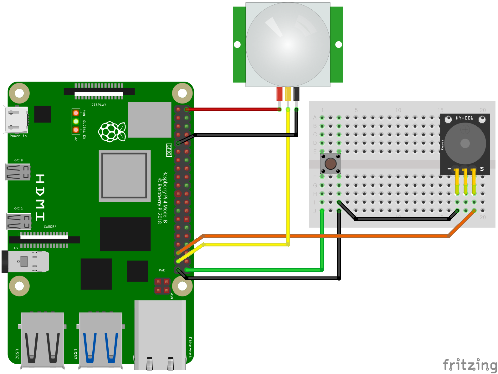

# picam  

[라즈베리파이](https://www.eleparts.co.kr/promotion/cate_event?event_seq=1622#1622_1), [PI 카메라(Camera Module 3 권장)](https://www.eleparts.co.kr/promotion/cate_event?event_seq=1622#1622_7)와 [DSI LCD](https://www.eleparts.co.kr/EPXY3WAF)를 이용하여 카메라를 제작하는 예제입니다.  

[PIR 센서](https://www.eleparts.co.kr/EPXF9YKT)와 연동해 물체의 움직임이 감지되면 자동으로 촬영하는 동작도 수행 가능합니다.  
  
  
## 본품 구성 키트  
[제작중입니다](https://www.eleparts.co.kr/promotion/cate_event?event_seq=1622)  
  
  
## 예제 다운로드&실행  

라즈베리파이에서 터미널 창을 열고 아래와 같이 입력해 주면 됩니다.  

```bash
# 저장소 다운로드  
git clone https://github.com/eleparts/picam

# 예제 코드 경로
cd picam/example

sudo python3 "예제 파일명(숫자 입력 후 tab키 누르면 자동완성됩니다)"
```  
  
  
## 하드웨어 연결하기  
  
예제 실행에 앞서 CSI(CAMERA) 포트에는  [Raspberry PI 카메라)](https://www.eleparts.co.kr/promotion/cate_event?event_seq=1622#1622_7)를, DSI(DISPLAY) 포트에는 [DSI LCD](https://www.eleparts.co.kr/EPXY3WAF)를 연결 해 줍니다.  
CSI/DSI 포트를 사용하는 카메라 및 LCD는 반드시 라즈베리파이의 전원을 끈 상태에서 연결해 주어야 합니다.  
  
나머지 부품들은 아래 회로 이미지를 참고하여 연결 해 주시면 됩니다.  

- **picam example schematic**  
  
  
  
## 권장 추가 설정  

LCD에 화면 출력 중 절전모드 진입 시 프레임이 매우 느려집니다.  
아래 설정으로 절전모드를 해제할 수 있습니다.  

/etc/lightdm/lightdm.conf 파일을 편집기로 열어 수정해 줍니다.   
```sudo nano /etc/lightdm/lightdm.conf```

방향키로 쭉 내려 [Seat:*] 항목 아래에 있는 ```#xserver-command=X``` 을 찾아 '#' 을 삭제 후 아래와 같이 수정해 줍니다.

```bash
xserver-command=X -s 0 -dpms

# 마우스 커서를 숨기고 싶은 경우(터치스크린 모드) 아래와 같이 옵션 추가
xserver-command=X -s 0 -dpms -nocursor
```
  
저장 후 종료(CTRL+O, ENTER, CTRL+X)해 주시면 됩니다.
  
  
## 카메라 예제 시작프로그램 등록(GUI 지원)  

GUI 예제는 부팅이 종료된 후 별도로 실행해 주어야 합니다.  
아래 설정으로 예제 파일을 시작 프로그램에 등록 할 수 있습니다.  

/etc/lightdm/lightdm.conf 파일을 편집기로 열어 실행할 파일을 추가 해 줍니다.  

```bash
sudo nano /etc/xdg/lxsession/LXDE-pi/autostart  
```

하단에 아래와 같이 추가해 줍니다.  

```bash
lxterminal -e python3 "자동 실행할 예제 파일(경로 포함)"

# 예시, ~/picam/QT_example 경로의 picam2_switch.py 예제 자동실행
lxterminal -e python3 ./picam/QT_example/picam2_switch.py
# 또는
lxterminal -e python3 /home/pi/picam/QT_example/picam2_switch.py    # user name 'pi'
```

예제 파일의 전체 경로 확인 방법은 예제 디렉토리로 이동해 ```pwd```명령어를 입력해 확인 가능합니다.  


## 참조  
  
참조 라이브러리  
  
- picamera2 라이브러리 Github 페이지  
https://github.com/raspberrypi/picamera2  
라이브러리 링크의 examples 경로에 다양한 카메라 라이브러리 사용 예제가 있습니다.  
  

라이브러리 설명 문서  
- picamera2 메뉴얼 문서  
https://datasheets.raspberrypi.com/camera/picamera2-manual.pdf  

